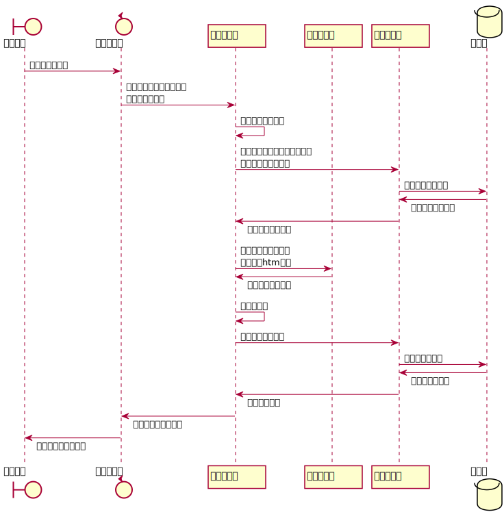
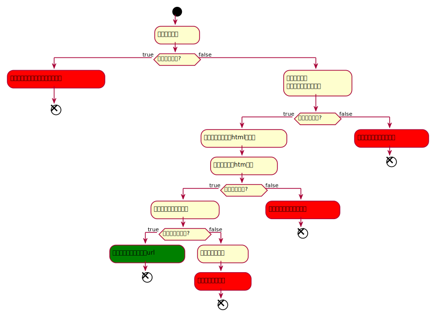

# 服务器

> 医院预约挂号平台与电子病历管理系统-服务器

## 依赖信息

本次的项目应该目前的条件，只有一个云服务器，并不适合使用微服务的框架，因此将会使用 `SpringBoot` 为基础进行开发。

目前的框架相关版本控制信息如下：

> 此处使用了 Spring Initializr 快速创建项目，自动控制大部分的依赖版本

- Java 1.8
- Spring 2.3.7.RELEASE
- Lombok 1.18.16
- MySQL Driver 8.0.22
- MyBatis Framework 2.1.4

## 项目结构

根据用例图，完成项目代码，并对代码的结构进行设计。


因为使用了MyBatis，利用其中的动态SQL语句特性，实现了动态查询的效果，因此基础的查询（`SELECT`）、更新（`UPDATE`）、插入（`INSERT`）和删除（`DELETE`）代码基本相同，为了减少其中的重复代码，抽出了 `GeneralMapperImpl` 的抽象类，在其中统一了CRUD操作，之后的Mapper只需要在此基础上进行扩展（`extends`）即可。

之后的部分与基础的代码框架基本一致，每个表格对应自己的Mapper，Mapper被特定的Service使用。项目中，主要的逻辑在Service中进行实现。最终通过Controller对外提供服务。

## 接口文档

其中一般遵循以下规则：

- 如果接口只接受一个参数，一般这个参数名就叫 `p`
- 查询数据的接口一般使用 `GET`
- 日期的格式都是 `yyyy-MM-dd HH:mm:ss` 或 `yyyy-MM-dd`
- 更新 `update`；插入 `insert`；删除 `delete`

### 用户信息

> `UserInfo` 中的数据 
>
> Long id; 
>
> String username;
>
> String password; 
>
> String passwordSalt; 
>
> String email; 
>
> Long phone; 
>
> Boolean isLogin; 
>
> LocalDateTime lastLoginTime; 
>
> String userImageUri;

| 登录接口 |                                                              |                                                              |
| -------- | ------------------------------------------------------------ | ------------------------------------------------------------ |
| 接口URI  | login                                                        |                                                              |
| 访问方式 | `POST`                                                       |                                                              |
| 参数     | `{ "username": username, "password": password }`<br />URL    |                                                              |
| 返回值   | - 成功 <br>`{ code: 200, msg: "登录成功", data: UserInfo }` <br> - 失败 <br>`{ code: ExceptionCode, msg: 登录失败提示信息, data: null }` | ExceptionCode 中错误码：<br>9999: 数据库中没有找到用户的密码盐<br>3000: 数据库操作报错<br>3001: 用户操作过程中出现报错，一般是常规错误 |


| 注销接口 |                                                              |                                                              |
| -------- | ------------------------------------------------------------ | ------------------------------------------------------------ |
| 接口URI  | logout                                                       |                                                              |
| 访问方式 | `POST`                                                       |                                                              |
| 参数     | `{ "username": username }`<br />URL                          |                                                              |
| 返回值   | - 成功 <br/>`{ code: 200, msg: "注销成功", data: UserInfo }` <br/> - 失败 <br/>`{ code: ExceptionCode, msg: 注册失败信息, data: null }` | ExceptionCode 中错误码：<br/>3000: 数据库操作报错<br/>3001: 用户操作过程中出现报错，一般是常规错误 |


| 注册接口 |                                                              |                                                              |
| -------- | ------------------------------------------------------------ | ------------------------------------------------------------ |
| 接口URI  | register                                                     |                                                              |
| 访问方式 | `POST`                                                       |                                                              |
| 参数     | `{ "username": username, "password": password, "passwordSalt": passwordSalt, ... }` | 其中，用户名和密码必填，其他可选，最好不要输入lastLoginTime，由服务器自动生成。**可以通过返回值中返回的对象得到自动生成的id** |
| 返回值   | - 成功 <br/>`{ code: 200, msg: "注册成功", data: userInfo }` <br/> - 失败 <br/>`{ code: ExceptionCode, msg: 注册失败信息, data: null }` | ExceptionCode 中错误码：<br/>3000: 数据库操作报错<br/>3001: 用户操作过程中出现报错，一般是常规错误 |


| 用户查询 |                                                              |                                                              |
| -------- | ------------------------------------------------------------ | ------------------------------------------------------------ |
| 接口URI  | users                                                        |                                                              |
| 访问方式 | `GET`                                                        |                                                              |
| 参数     | `{ "p": { key: value, ... },"pageNum": pageNum, "pageSize": pageSize, "ordered": key, "desc": isDesc }` | - `p` 用于查找的Map，其中的key就是上方的`UserInfo` 的属性名<br>- `pageNum` 页号；`pageSize` 页大小（默认为显示10条数据）<br>- `ordered` 排序的键；`desc` 是否逆序（默认正序）<br />所有参数可选，如果为空，表示没有限定条件，结果的数量按照默认数量 |
| 返回值   | - 成功 <br/>`{ code: 200, msg: 查询成功, data: [userInfo1, userInfo2, ] }` <br/> - 失败 <br/>`{ code: ExceptionCode, msg: 查询失败信息, data: null }` | ExceptionCode 中错误码：<br/>3000: 数据库操作报错<br/>3001: 用户操作过程中出现报错，一般是常规错误 |


| 用户更新 |                                                              |                                                              |
| -------- | ------------------------------------------------------------ | ------------------------------------------------------------ |
| 接口URI  | users/update                                                 |                                                              |
| 访问方式 | `POST`                                                       |                                                              |
| 参数     | `{ "before": { key: value, ... }, "after": { key: value, ... } }` | - `before` 表示用于寻找的 Map，筛选需要更新的用户<br>- `after` 表示修改的新的键值对 |
| 返回值   | - 成功 <br/>`{ code: 200, msg: 更新成功, data: 更新成功的数量 }` <br/> - 失败 <br/>`{ code: ExceptionCode, msg: 更新失败信息, data: null }` | ExceptionCode 中错误码：<br/>3000: 数据库操作报错<br/>3001: 用户操作过程中出现报错，一般是常规错误 |


| 用户添加 |                                                              |                                                              |
| -------- | ------------------------------------------------------------ | ------------------------------------------------------------ |
| 接口URI  | users/insert                                                 |                                                              |
| 访问方式 | `POST`                                                       |                                                              |
| 参数     | `[ {"username": username, "password": password, "passwordSalt": passwordSalt, ...}, {"username": username, "password": password, "passwordSalt": passwordSalt, ...}, ]` | 用户名和密码必填，其他可选，一般不传id，使用数据库自动生成，最好不要输入lastLoginTime，由服务器自动生成。**可以通过返回值中得到的对象来获取到自动生成的id** |
| 返回值   | - 成功 <br/>`{ code: 200, msg: 添加成功, data: {"count": 添加成功的数量, "result": 初始化之后的对象列表} }` <br/> - 失败 <br/>`{ code: ExceptionCode, msg: 添加失败信息, data: null }` | ExceptionCode 中错误码：<br/>3000: 数据库操作报错<br/>3001: 用户操作过程中出现报错，一般是常规错误 |


| 用户删除 |                                                              |                                                              |
| -------- | ------------------------------------------------------------ | ------------------------------------------------------------ |
| 接口URI  | users/delete                                                 |                                                              |
| 访问方式 | `POST`                                                       |                                                              |
| 参数     | `{ key: value, ... }`                                        | key 对应上方的 `UserInfo` 的属性名<br />如，需要删除的是 `username` 等于 test1 此处就传入<br />`{ "username": "test1" }` |
| 返回值   | - 成功 <br/>`{ code: 200, msg: 删除成功, data: 删除成功的数量 }` <br/> - 失败 <br/>`{ code: ExceptionCode, msg: 删除失败信息, data: null }` | ExceptionCode 中错误码：<br/>3000: 数据库操作报错<br/>3001: 用户操作过程中出现报错，一般是常规错误 |

### 科室信息

> `DepartmentInfo` 中的数据
>
> Long id;
> Long hospitalId; 
> String departmentName;
>
> hospitalId 暂时不影响，基本上没有用，如果之后需要可以直接支持，目前默认为0，可以不传

| 科室查找 |                                                              |                                                              |
| -------- | ------------------------------------------------------------ | ------------------------------------------------------------ |
| 接口URI  | departments                                                  |                                                              |
| 访问方式 | `GET`                                                        |                                                              |
| 参数     | `{ "p": { key: value, ... },"pageNum": pageNum, "pageSize": pageSize, "ordered": key, "desc": isDesc }` | - `p` 用于查找的Map，其中的key就是上方的`DepartmentInfo` 的属性名<br/>- `pageNum` 页号；`pageSize` 页大小（默认为显示10条数据）<br/>- `ordered` 排序的键；`desc` 是否逆序（默认正序）<br />所有参数可选，如果为空，表示没有限定条件，结果的数量按照默认数量 |
| 返回值   | - 成功 <br/>`{ code: 200, msg: 查询成功, data: [departmentInfo1, departmentInfo2, ] }` <br/> - 失败 <br/>`{ code: ExceptionCode, msg: 查询失败信息, data: null }` | ExceptionCode 中错误码：<br/>3000: 数据库操作报错<br/>3003: 科室数据操作过程中出现报错，一般是常规错误 |


| 科室更新 |                                                              |                                                              |
| -------- | ------------------------------------------------------------ | ------------------------------------------------------------ |
| 接口URI  | departments/update                                           |                                                              |
| 访问方式 | `POST`                                                       |                                                              |
| 参数     | `{ "before": { key: value, ... }, "after": { key: value, } }` | - `before` 表示用于寻找的 Map，筛选需要更新的科室<br>- `after` 表示修改的新的键值对 |
| 返回值   | - 成功 <br/>`{ code: 200, msg: 更新成功, data: 更新成功的数量 }` <br/> - 失败 <br/>`{ code: ExceptionCode, msg: 更新失败信息, data: null }` | ExceptionCode 中错误码：<br/>3000: 数据库操作报错<br/>3003: 科室数据操作过程中出现报错，一般是常规错误 |


| 科室添加 |                                                              |                                                              |
| -------- | ------------------------------------------------------------ | ------------------------------------------------------------ |
| 接口URI  | departments/insert                                           |                                                              |
| 访问方式 | `POST`                                                       |                                                              |
| 参数     | `[ {"id": id, "hospitalId": hospitalId, "departmentName": departmentName}, ... ]` | 所有数据可选，一般不传id，使用数据库自动生成。**可以通过返回值中返回的对象来得到自动生成的id** |
| 返回值   | - 成功 <br/>`{ code: 200, msg: 添加成功, data: {"count": 添加成功的数量, "result": 初始化之后的对象列表} }` <br/> - 失败 <br/>`{ code: ExceptionCode, msg: 添加失败信息, data: null }` | ExceptionCode 中错误码：<br/>3000: 数据库操作报错<br/>3003: 科室数据操作过程中出现报错，一般是常规错误 |


| 科室删除 |                                                              |                                                              |
| -------- | ------------------------------------------------------------ | ------------------------------------------------------------ |
| 接口URI  | departments/delete                                           |                                                              |
| 访问方式 | `POST`                                                       |                                                              |
| 参数     | `{ key: value, ... }`                                        | key 对应上方的 `DepartmentInfo` 的属性名<br />如，查询“口腔科”，则 `{ "departmentName": "口腔科" }` |
| 返回值   | - 成功 <br/>`{ code: 200, msg: 删除成功, data: 删除的数量 }` <br/> - 失败 <br/>`{ code: ExceptionCode, msg: 删除失败信息, data: null }` | ExceptionCode 中错误码：<br/>3000: 数据库操作报错<br/>3003: 科室数据操作过程中出现报错，一般是常规错误 |

### 医生信息

> `DoctorInfo` 中的数据
>
> Long id;
> Long departmentId;
> String doctorName;
> Float reservationPrice;
> Integer remainingCapacity;
> String doctorImageUri;

| 医生查找 |                                                              |                                                              |
| -------- | ------------------------------------------------------------ | ------------------------------------------------------------ |
| 接口URI  | doctors                                                      |                                                              |
| 访问方式 | `GET`                                                        |                                                              |
| 参数     | `{ "p": { key: value, ... },"pageNum": pageNum, "pageSize": pageSize, "ordered": key, "desc": isDesc }` | - `p` 用于查找的Map，其中的key就是上方的`DepartmentInfo` 的属性名<br/>- `pageNum` 页号；`pageSize` 页大小（默认显示10条数据）<br/>- `ordered` 排序的键；`desc` 是否逆序（默认正序）<br />所有参数可选，如果为空，表示没有限定条件，结果的数量按照默认数量 |
| 返回值   | - 成功 <br/>`{ code: 200, msg: 查询成功, data: [doctorInfo1, doctorInfo2, ] }` <br/> - 失败 <br/>`{ code: ExceptionCode, msg: 查询失败信息, data: null }` | ExceptionCode 中错误码：<br/>3000: 数据库操作报错<br/>3004: 医生数据操作过程中出现报错，一般是常规错误 |


| 医生更新 |                                                              |                                                              |
| -------- | ------------------------------------------------------------ | ------------------------------------------------------------ |
| 接口URI  | doctors/update                                               |                                                              |
| 访问方式 | `POST`                                                       |                                                              |
| 参数     | `{ "before": { key: value, ... }, "after": { key: value, ... } }` | - `before` 表示用于寻找的 Map，筛选需要更新的科室<br>- `after` 表示修改的新的键值对 |
| 返回值   | - 成功 <br/>`{ code: 200, msg: 更新成功, data: 更新成功的数量 }` <br/> - 失败 <br/>`{ code: ExceptionCode, msg: 更新失败信息, data: null }` | ExceptionCode 中错误码：<br/>3000: 数据库操作报错<br/>3004: 医生数据操作过程中出现报错，一般是常规错误 |


| 科室添加 |                                                              |                                                              |
| -------- | ------------------------------------------------------------ | ------------------------------------------------------------ |
| 接口URI  | doctors/insert                                               |                                                              |
| 访问方式 | `POST`                                                       |                                                              |
| 参数     | `[ {"id": id, "departmentId": departmentId, "doctorName": doctorName, "reservationPrice": reservationPrice, ...}, ... ] ` | 其中，科室id必填（医生姓名不填不会报错，但是从逻辑上讲应该也是必填），其他可选，id最好由服务器自动生成（**在返回值中，可以得到新建对象的id**） |
| 返回值   | - 成功 <br/>`{ code: 200, msg: 添加成功, data: {"count": 添加成功的数量, "result": 经过初始化后的对象列表} }` <br/> - 失败 <br/>`{ code: ExceptionCode, msg: 添加失败信息, data: null }` | ExceptionCode 中错误码：<br/>3000: 数据库操作报错<br/>3004: 医生数据操作过程中出现报错，一般是常规错误 |


| 医生删除 |                                                              |                                                              |
| -------- | ------------------------------------------------------------ | ------------------------------------------------------------ |
| 接口URI  | doctors/delete                                               |                                                              |
| 访问方式 | `POST`                                                       |                                                              |
| 参数     | `{ key: value, ... }`                                        | key 对应上方的 `DoctorInfo` 的属性名<br />如，需要查询医生小明，则 `{"doctorName": "小明"}` |
| 返回值   | - 成功 <br/>`{ code: 200, msg: 删除成功, data: 删除的数量 }` <br/> - 失败 <br/>`{ code: ExceptionCode, msg: 删除失败信息, data: null }` | ExceptionCode 中错误码：<br/>3000: 数据库操作报错<br/>3004: 医生操作过程中出现报错，一般是常规错误 |

### 预约订单接口

> 预约数据
>
> String id;
> Long userId;
> String username;（只能看）
> Long doctorId;
> String doctorName;（只能看）
> String departmentName;（只能看）
> LocalDate reservationDate;
> Float reservationPrice;
> Integer reservationStatus;
>
> reservationDate 遵守 `yyyy-MM-dd` 格式进行传输
> reservationStatus 预约订单的状态，0未支付，1已支付，2已报道，3已处理，9已取消

| 预约订单查找 |                                                              |                                                              |
| ------------ | ------------------------------------------------------------ | ------------------------------------------------------------ |
| 接口URI      | reservations                                                 |                                                              |
| 访问方式     | `GET`                                                        |                                                              |
| 参数         | `{ "p": { key: value, ... },"pageNum": pageNum, "pageSize": pageSize, "ordered": key, "desc": isDesc }` | - `p` 用于查找的Map，其中的key就是上方的`DepartmentInfo` 的属性名<br/>- `pageNum` 页号；`pageSize` 页大小（默认显示10条数据）<br/>- `ordered` 排序的键；`desc` 是否逆序（默认正序）<br />所有参数可选，如果为空，表示没有限定条件，结果的数量按照默认数量 |
| 返回值       | - 成功 <br/>`{ code: 200, msg: 查询成功, data: [预约订单对象, ... ] }` <br/> - 失败 <br/>`{ code: ExceptionCode, msg: 查询失败信息, data: null }` | ExceptionCode 中错误码：<br/>3000: 数据库操作报错<br/>3005: 预约订单数据操作过程中出现报错，一般是常规错误 |


| 预约订单更新 |                                                              |                                                              |
| ------------ | ------------------------------------------------------------ | ------------------------------------------------------------ |
| 接口URI      | reservations/update                                          |                                                              |
| 访问方式     | `POST`                                                       |                                                              |
| 参数         | `{ "before": { key: value, ... }, "after": { key: value, ... } }` | - `before` 表示用于寻找的 Map，筛选需要更新的订单信息<br>- `after` 表示修改的新的键值对 |
| 返回值       | - 成功 <br/>`{ code: 200, msg: 更新成功, data: 更新成功的数量 }` <br/> - 失败 <br/>`{ code: ExceptionCode, msg: 更新失败信息, data: null }` | ExceptionCode 中错误码：<br/>3000: 数据库操作报错<br/>3005: 预约订单数据操作过程中出现报错，一般是常规错误 |


| 添加预约订单添加 |                                                              |                                                              |
| ---------------- | ------------------------------------------------------------ | ------------------------------------------------------------ |
| 接口URI          | reservations/insert                                          | 该接口一般不使用，预约订单的添加通过下方的预约接口自动添加<br />**管理员接口** |
| 访问方式         | `POST`                                                       |                                                              |
| 参数             | `[ {"id": id, "userId": userId, "doctorId": doctorId, "reservationDate": reservationDate, ...}, ... ] ` | 其中，用户id、医生id以及预约的时间必填，其他可选，id最好由服务器自动生成（**在返回值中，可以得到新建对象的id**） |
| 返回值           | - 成功 <br/>`{ code: 200, msg: 添加成功, data: {"count": 添加成功的数量, "result": 经过初始化后的对象列表} }` <br/> - 失败 <br/>`{ code: ExceptionCode, msg: 添加失败信息, data: null }` | ExceptionCode 中错误码：<br/>3000: 数据库操作报错<br/>3005: 预约订单数据操作过程中出现报错，一般是常规错误 |


| 预约订单删除 |                                                              |                                                              |
| ------------ | ------------------------------------------------------------ | ------------------------------------------------------------ |
| 接口URI      | reservations/delete                                          | 预约订单一般不需要删除，通过修改其状态即可<br />**管理员接口** |
| 访问方式     | `POST`                                                       |                                                              |
| 参数         | `{ key: value, ... }`                                        | key 对应上方的预约订单的属性名<br />如，需要删除医生id为4的订单，则 `{"doctorId": 4}` |
| 返回值       | - 成功 <br/>`{ code: 200, msg: 删除成功, data: 删除的数量 }` <br/> - 失败 <br/>`{ code: ExceptionCode, msg: 删除失败信息, data: null }` | ExceptionCode 中错误码：<br/>3000: 数据库操作报错<br/>3005: 预约订单数据操作过程中出现报错，一般是常规错误 |

### 历史病例

> 历史病例数据
>
> Long id;
> Long userId;
> Long doctorId;
> LocalDate medicalDate;
> String medicalHistoryUri;
>
> medicalDate 遵守 `yyyy-MM-dd` 格式进行传输

| 预约订单查找 |                                                              |                                                              |
| ------------ | ------------------------------------------------------------ | ------------------------------------------------------------ |
| 接口URI      | medicals                                                     |                                                              |
| 访问方式     | `GET`                                                        |                                                              |
| 参数         | `{ "p": { key: value, ... },"pageNum": pageNum, "pageSize": pageSize, "ordered": key, "desc": isDesc }` | - `p` 用于查找的Map，其中的key就是上方的`DepartmentInfo` 的属性名<br/>- `pageNum` 页号；`pageSize` 页大小（默认显示10条数据）<br/>- `ordered` 排序的键；`desc` 是否逆序（默认正序）<br />所有参数可选，如果为空，表示没有限定条件，结果的数量按照默认数量 |
| 返回值       | - 成功 <br/>`{ code: 200, msg: 查询成功, data: [历史病例对象, ... ] }` <br/> - 失败 <br/>`{ code: ExceptionCode, msg: 查询失败信息, data: null }` | ExceptionCode 中错误码：<br/>3000: 数据库操作报错<br/>3006: 历史病例数据操作过程中出现报错，一般是常规错误 |


| 预约订单更新 |                                                              |                                                              |
| ------------ | ------------------------------------------------------------ | ------------------------------------------------------------ |
| 接口URI      | medicals/update                                              |                                                              |
| 访问方式     | `POST`                                                       |                                                              |
| 参数         | `{ "before": { key: value, ... }, "after": { key: value, ... } }` | - `before` 表示用于寻找的 Map，筛选需要更新的订单信息<br>- `after` 表示修改的新的键值对 |
| 返回值       | - 成功 <br/>`{ code: 200, msg: 更新成功, data: 更新成功的数量 }` <br/> - 失败 <br/>`{ code: ExceptionCode, msg: 更新失败信息, data: null }` | ExceptionCode 中错误码：<br/>3000: 数据库操作报错<br/>3006: 历史病例数据操作过程中出现报错，一般是常规错误 |


| 添加预约订单添加 |                                                              |                                                              |
| ---------------- | ------------------------------------------------------------ | ------------------------------------------------------------ |
| 接口URI          | medicals/insert                                              |                                                              |
| 访问方式         | `POST`                                                       |                                                              |
| 参数             | `[ {"id": id, "userId": userId, "doctorId": doctorId, "medicalDate": medicalDate, ...}, ... ] ` | 其中，用户id、医生id以及病例的时间必填，其他可选，id最好由服务器自动生成（**在返回值中，可以得到新建对象的id**） |
| 返回值           | - 成功 <br/>`{ code: 200, msg: 添加成功, data: {"count": 添加成功的数量, "result": 经过初始化后的对象列表} }` <br/> - 失败 <br/>`{ code: ExceptionCode, msg: 添加失败信息, data: null }` | ExceptionCode 中错误码：<br/>3000: 数据库操作报错<br/>3006: 历史病例数据操作过程中出现报错，一般是常规错误 |


| 科室删除 |                                                              |                                                              |
| -------- | ------------------------------------------------------------ | ------------------------------------------------------------ |
| 接口URI  | medicals/delete                                              | 预约订单一般不删除<br />**管理员接口**                       |
| 访问方式 | `POST`                                                       |                                                              |
| 参数     | `{ key: value, ... }`                                        | key 对应上方的预约订单的属性名<br />如，需要删除医生id为4的病例，则 `{"doctorId": 4}` |
| 返回值   | - 成功 <br/>`{ code: 200, msg: 删除成功, data: 删除的数量 }` <br/> - 失败 <br/>`{ code: ExceptionCode, msg: 删除失败信息, data: null }` | ExceptionCode 中错误码：<br/>3000: 数据库操作报错<br/>3006: 历史病例数据操作过程中出现报错，一般是常规错误 |

### 预约接口

| 预约     |                                                              |                                                              |
| -------- | ------------------------------------------------------------ | ------------------------------------------------------------ |
| 接口URI  | reservation                                                  |                                                              |
| 访问方式 | `POST`                                                       |                                                              |
| 参数     | `{ "userId": userId, "doctorId": doctorId, "date": date }`<br />URL | - `date` 表示预约的时间，使用 `yyyy-MM-dd` 格式              |
| 返回值   | - 成功 <br/>`{ code: 200, msg: 预约成功, data: 预约订单号 }` <br/> - 失败 <br/>`{ code: ExceptionCode, msg: 预约失败信息, data: null }` | ExceptionCode 中错误码：<br/>3000: 数据库操作报错<br/>3001: 用户查询出现问题，一般是常规错误<br />3004: 医生查询出现问题，一般是常规错误<br />4000: 医生操作过程中出现报错，一般是常规错误 |


| 查询剩余容量 |                                                              |                                                              |
| ------------ | ------------------------------------------------------------ | ------------------------------------------------------------ |
| 接口URI      | capacity                                                     |                                                              |
| 访问方式     | `GET`                                                        |                                                              |
| 参数         | `{ doctorId: doctorId, date: date }`<br />URL                | - `date` 表示预约的时间，使用 `yyyy-MM-dd` 格式              |
| 返回值       | - 成功 <br/>`{ code: 200, msg: 查询成功, data: 剩余容量 }` <br/> - 失败 <br/>`{ code: ExceptionCode, msg: 查询失败信息, date: null }` | ExceptionCode 中错误码：<br/>3000: 数据库操作报错<br/>3004: 医生查询出现问题，一般是常规错误<br />4000: 医生操作过程中出现报错，一般是常规错误 |

### 文件接口

| 文件/头像上传 |                                                              |                                                              |
| ------------- | ------------------------------------------------------------ | ------------------------------------------------------------ |
| 接口URI       | file/update                                                  |                                                              |
| 访问方式      | `POST`                                                       |                                                              |
| 参数          | `{ file: 上传的文件 }`                                       | 目前服务器这边限制文件大小是10m内，效率不足，正在考虑再限制文件大小 |
| 返回值        | - 成功 <br/>`{ code: 200, msg: 查询成功, data: 文件对应的URL }` <br/> - 失败 <br/>`{ code: ExceptionCode, msg: 查询失败信息, date: null }` | ExceptionCode 中错误码：<br/>3000: 数据库操作报错<br/>9998: 文件操作相关错误，可能是文件操作出错或是文件相关的数据操作过程出错 |


| 病例文件生成（htm文件） |                                                              |                                                              |
| ----------------------- | ------------------------------------------------------------ | ------------------------------------------------------------ |
| 接口URI                 | medical/general                                              |                                                              |
| 访问方式                | `POST`                                                       |                                                              |
| 参数                    | `{ "p": { key1: value1, ... }, "name": 用户名, "reservationCode": 预约订单号（最终的文件名）, "doctorName": 医生名, "medicalDate": 病例的时间（可选） }` | `p` 中<br />如果不传 `medicalDate` 病例的时间，默认为当前    |
| 返回值                  | - 成功 <br/>`{ code: 200, msg: 模板上传成功, data: 文件对应的URL }` <br/> - 失败 <br/>`{ code: ExceptionCode, msg: 模板上传失败, date: null }` | ExceptionCode 中错误码：<br/>3000: 数据库操作报错<br/>9998: 文件操作相关错误，可能是文件操作出错或是文件相关的数据操作过程出错 |

### 支付接口

| 支付     |                                                              | **<span style="color:red">待测试</span>**                    |
| -------- | ------------------------------------------------------------ | ------------------------------------------------------------ |
| 接口URI  | alipay/page                                                  | 跳转支付包界面网页                                           |
| 访问方式 | `POST`                                                       |                                                              |
| 参数     | `{ "reservcationId": reservationId }`                        |                                                              |
| 返回值   | - 成功 <br/>`{ code: 200, msg: 支付成功, data: 支付结果 }` <br/> - 失败 <br/>`{ code: ExceptionCode, msg: 支付失败, date: null }` | ExceptionCode 中错误码：<br/>3000: 数据库操作报错<br/>9996: 支付相关错误，可能是alipay接口出现的问题或是数据更新异常 |


| 退款     |                                                              |                                                              |
| -------- | ------------------------------------------------------------ | ------------------------------------------------------------ |
| 接口URI  | alipay/refund                                                | 退款功能（测试中）                                           |
| 访问方式 | `POST`                                                       |                                                              |
| 参数     | `{ "reservcationId": reservationId }`                        |                                                              |
| 返回值   | - 成功 <br/>`{ code: 200, msg: 退款成功, data: 退款结果 }` <br/> - 失败 <br/>`{ code: ExceptionCode, msg: 退款失败, date: null }` | ExceptionCode 中错误码：<br/>3000: 数据库操作报错<br/>9996: 支付相关错误，可能是alipay接口出现的问题或是数据更新异常 |

## 功能分析图

对系统中比较重要的接口流程进行分析

### 登录接口


### 预约接口


### 头像上传


### 生成病例文件






# 部分功能点实现

## 单点登录

该系统中涉及到了支付，因此希望保证同一时间一个账号只能在一个地方进行登录，为了保证这一点，目前现有的单点登录主要有两个不同的实现逻辑：

1. 在第二次登陆时，提示该账号已经在登录中登录失败
2. 在第二次登录时，将之前登录的该账号挤掉，保证只有一个该账号正在使用

### 简单分析

虽然第一种方式乍一看会比较好实现，但是因为此处使用的是 BS 架构，http 协议实现客户端与服务器之间的交互，导致服务器并没有很好的方式确保用户已经退出登录。如，用户直接关闭网站，此时却没有使用提供的注销方法正常退出，导致该账号一致锁定在登录状态，就算使用 Cookie 来保存用户登录状态，如果 Cookie 被清理将导致最后一个可以正常访问的用户也消失。

同时，BS 架构也不方便使用心跳连接的方式来检测用户是否存活，因此，这个方式的实现暂时被否认，转而使用了第二种实现的方式。

为了同一时间一个账号只有一个登录，每次登录操作就会生成一个唯一的编号，将这个值存放在 Token 中，之后的用户访问都会携带这条信息，通过校验用户访问的 Token 就能实现单点登录的校验，同时也能完成用户的登录校验，防止非法访问。

### 实现

通过使用 `JWT` 中的方法，创建标准的 Token。

Token 由三个部分组成，头部 header、数据 payload 和签名 signature。此处，将用户 id、用户名存储 header，将用于校验的登录唯一编号存储在 signature 中，之后每次登录通过用户id来查询用户数据，校验其对应的登录唯一编号与 signature 中的值是否相等即可。

# 补充内容

## 多环境配置

SpringBoot 在同一个中，配置不同的环境（端口），同时开启两个进程，实现一个jar运行两个端口的效果。

### 配置文件

```yaml
spring:
  profiles:
    active: demo1
---
spring:
  application:
    name: demo_hospital_project
  datasource:
    driver-class-name: com.mysql.cj.jdbc.Driver
    name: mysql
    url: jdbc:mysql://111.229.139.12:3306/demo_hospital_project?serverTimezone=GMT%2B8
    username: root
    password: root
  profiles: demo1

server:
  port: 12301

mybatis:
  mapper-locations: classpath:mappers/*.xml
  type-aliases-package: com.hospital.xhu.demo.entity
  configuration:
    log-impl: org.apache.ibatis.logging.stdout.StdOutImpl  # 显示MyBatis的log信息到控制台

cache:
  cache_size: 1000
  limit_time: 1200  # LRU删除的时间
---
spring:
  application:
    name: demo_hospital_project
  datasource:
    driver-class-name: com.mysql.cj.jdbc.Driver
    name: mysql
    url: jdbc:mysql://111.229.139.12:3306/demo_hospital_project?serverTimezone=GMT%2B8
    username: root
    password: root
  profiles: demo2

server:
  port: 12302

mybatis:
  mapper-locations: classpath:mappers/*.xml
  type-aliases-package: com.hospital.xhu.demo.entity
  configuration:
    log-impl: org.apache.ibatis.logging.stdout.StdOutImpl  # 显示MyBatis的log信息到控制台

cache:
  cache_size: 1000
  limit_time: 1200  # LRU删除的时间
```

### 启动配置

```bash
java -jar demo-0.0.1-SNAPSHOT.jar --spring.profiles.active=demo1
```

## Nginx

使用高性能的Nginx服务器作为服务器的网关，完成请求转发、静态服务器的功能。

### 静态服务器

Nginx 中，通过一下配置，就能直接实现静态服务器配置：

```nginx
# 之前的内容省略
server {
  
  location /img {
    root /var/local/;  # 映射的地址
    autoindex on;  # 开启在网页直接管理静态资源的功能
  }
}
```

> 通过上方的映射，确实可以访问静态资源，但是路径会报错。
>
> 上例中最终对应的默认资源地址为 `/var/local/img`

